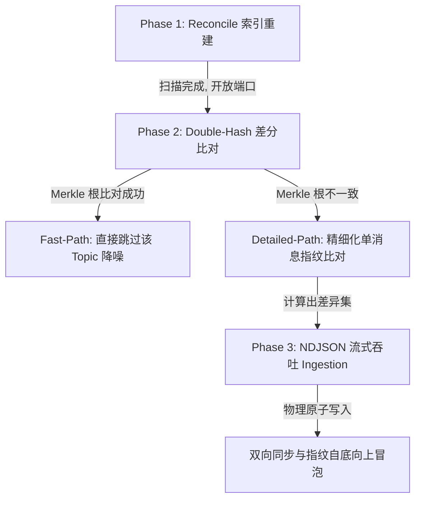

# VCPMobileSync (VCP 移动端双向增量同步服务插件)

[](./plugin-manifest.json)
[](https://nodejs.org)
[](#协议-14-硬切与兼容边界)

**让 VCPChat 桌面端和 VCPMobile 手机端的数据进行可诊断、失败即停的双向增量同步。**

VCPMobileSync 是 VCPChat 桌面端的专属分布式服务插件，采用 Legacy/CDS 双模式的三阶段增量同步架构。实体配置、消息正文、墓碑、头像字节以及消息内附件元数据按各自合同传输；附件二进制始终保留在两端本机 CAS，不属于同步数据面。

> [!IMPORTANT]
> 本版本只修改 MobileSync 插件与 VCP-CDS 同步接口，不修改模型调用、提示词、消息渲染或普通聊天保存逻辑。中央模式的 Mobile→Desktop 消息同步会投影并写入 `history.json`；Wire 1.4 使用完整复合身份、强类型状态和统一 `ok/error` 外壳。

---

## 📖 目录
1. [这个插件能同步什么？](#-这个插件能同步什么)
2. [🚀 快速开始与部署](#-快速开始与部署)
   - [安装依赖](#安装依赖)
   - [配置插件](#配置插件)
   - [手机端配置](#手机端配置)
   - [日常使用规范](#日常使用规范)
3. [🛡️ 三阶段增量同步协议 V2 深度揭秘](#-三阶段增量同步协议-v2-深度揭秘)
   - [Phase 1: 轻量级索引扫描 (Reconcile)](#phase-1-轻量级索引扫描-reconcile)
   - [Phase 2: 双哈希差分比对 (Double-Hash Merkle Diff)](#phase-2-双哈希差分比对-double-hash-merkle-diff)
   - [Phase 3: 极速 NDJSON 流式吞吐 (Stream Ingestion)](#phase-3-极速-ndjson-流式吞吐-stream-ingestion)
4. [📐 硬核数据模型与表结构](#-硬核数据模型与表结构)
5. [🔒 数据完整性与安全防线](#-数据完整性与安全防线)
   - [防哈希分裂技术 (stableStringify)](#防哈希分裂技术-stablestringify)
   - [墓碑拦截机制与防数据回流](#墓碑拦截机制与防数据回流)
   - [并发读写锁与原子写入防线](#并发读写锁与原子写入防线)
   - [最新 Session-Phase-Operation 日志轮转系统](#最新-session-phase-operation-日志轮转系统)
6. [💡 故障排查与常见 Q&A](#-故障排查与常见-qa)

---

## 📂 这个插件能同步什么？

| 数据类型 | 说明 | 物理同步范围 |
| :--- | :--- | :--- |
| 👤 **智能体 (Agent)** | 名称、系统提示词、温度、采样参数、当前关联的模型配置 | `Agents/{id}/config.json` |
| 👥 **群组 (Group)** | 群成员列表、群发言策略、群系统提示词、活跃配置等 | `AgentGroups/{id}/config.json` |
| 💬 **话题 (Topic)** | 挂载于智能体或群组之下的独立子话题元数据 | Owner `config.json.topics[]`；物理存活由 `UserData/{ownerId}/topics/{topicId}/` 决定 |
| ✉️ **消息历史 (Message)** | 包含思维链 (Thinking) 节点、Markdown 文本及元数据的完整聊天链路 | `UserData/{parentId}/topics/{topicId}/history.json` |
| 📎 **附件 (Attachment)** | 双向只同步消息内附件元数据与内容 Hash；二进制文件保留在各端本机 CAS | `UserData/attachments/{hash}.{ext}` |
| 🖼️ **自定义头像 (Avatar)** | 智能体、群组及用户本身的个性化头像二进制数据 | `Agents|AgentGroups/{id}/avatar.{png,jpg,jpeg,gif,webp}` 及 `UserData/user_avatar.png` |

> [!NOTE]
> **冲突策略**：自身 Hash 不同时以 `updatedAt` 较新的一端为准；消息时间相同再按 `messageHash` 字典序裁决。墓碑使用独立删除状态，不从 live 列表缺失推断删除。

---

## 🚀 快速开始与部署

### 安装依赖
插件依赖于 SQLite 数据库的原生 C++ 驱动 `better-sqlite3`。在 VCPChat **桌面端根目录**下执行以下命令进行依赖安装与本地 ABI 重新编译：
```bash
# 1. 安装底层 SQLite 原生依赖
pnpm install better-sqlite3

# 2. 针对 Electron 的 ABI 版本重新编译原生扩展（发布前必须步骤，否则插件启动会因 ABI 错误报错）
pnpm exec electron-rebuild --only better-sqlite3
```

### 配置插件
1. 在插件目录 `VCPMobileSync/` 下，复制配置模板：
   ```bash
   cp config.env.example config.env
   ```
2. 编辑 `config.env`，填写同步身份校验令牌和端口：
   ```env
   # 【必填】同步安全令牌。手机端建立连接时的握手密码，建议设置复杂字符串
   MobileSyncToken=your_super_secret_token_here
   
   # 【必填】同步服务绑定的 WebSocket/HTTP 端口，默认 5975
   MobileSyncPort=5975
   ```

### 手机端配置
打开手机端 VCPMobile $\rightarrow$ **设置** $\rightarrow$ **同步设置**，填写以下核心连接参数：

| 手机端显示的名称 | 示例值 | 说明 |
| :--- | :--- | :--- |
| **HTTP 服务 URL** | `http://192.168.1.100:5974` | 桌面端分布式服务器的 HTTP 端口（通常为 5974） |
| **WebSocket 服务 URL** | `ws://192.168.1.100:5975` | 本插件同步总线绑定的 WebSocket 端口（通常为 5975） |
| **Mobile Sync Token** | `your_super_secret_token_here` | 必须与上方桌面端 `config.env` 中配置的令牌 100% 一致 |

> [!WARNING]
> **局域网限制**：电脑和手机必须处在同一局域网（例如连接同一个物理 WiFi 或是通过内网穿透 VPN 组网）下才能建立通信。

### 日常使用规范
1. **启动服务**：
   打开 VCPChat 桌面端 $\rightarrow$ **全局设置** $\rightarrow$ **高级功能** $\rightarrow$ 开启「VCP分布式服务器」 $\rightarrow$ **重启客户端**。
2. **首次同步**：
   * 中央索引默认开启，由 VCP-CDS 扫描 Owner、`history.json` 与 Avatar，并维护 `AppData/databases/chat_data.sqlite3`。显式设置 `MobileSyncUseCentralIndex=false` 后，只有重启后的新同步 session 才切换到插件 `sync_state_v2.db` 路径。
   * 等待 VCP-CDS 与 MobileSync 服务就绪后，在手机端点击「立即同步」即可开始全量传输。
3. **日常静默**：
   * 只要桌面端服务器开启，手机端会利用高稳定性通道在后台保持实时或手动的增量数据对齐，仅同步变化内容（每次通常仅需几十 KB 流量）。

---

## 协议 1.4 硬切与兼容边界

公开握手固定为：

```text
VERSION_CHECK { mobileVersion, protocolVersion: "1.4" }
VERSION_ACK   { pluginVersion: "1.4.0", protocolVersion: "1.4" }
```

兼容性只由 `protocolVersion` 精确判断；`pluginVersion` 是诊断信息。旧 Wire 不保留别名或双栈。Phase 3 每个 Topic 的 decision 必须是以下判别联合之一：

```text
{ ownerType, ownerId, topicId, ok: true,
  pullMessageIds: string[], pushTopic: boolean, deleteMessages: MessageTombstone[] }
{ ownerType, ownerId, topicId, ok: false, error: WireSyncError }
```

缺字段、错类型、重复身份、`ok:false` 或未知帧都会终止当前 attempt，不能进入完成态。

错误在 WebSocket、HTTP、NDJSON 和逐 Topic 结果中复用同一个对象：

```json
{
  "code": "SYNC_OWNER_CONFLICT",
  "origin": "desktop_cds",
  "stage": "messages",
  "kind": "data",
  "retry": "manual",
  "message": "owner identity conflict",
  "failedTopicIds": ["topic-a"]
}
```

固定外壳分别是 `SYNC_ERROR.error`、HTTP `{error}`、逐项 `ok:false,error`，以及 NDJSON `{kind:"streamError",error}`。对象必须包含全部七个字段，未知字段与字符串错误均拒绝。`message` 是脱敏诊断信息，最终用户中文原因与唯一下一步由 Mobile 按 code 固定映射。

VCP-CDS internal protocol 3 的逐项错误固定为 `{code,message,retryable}`；Central Adapter 只在公共边界补齐 `origin/stage/kind/retry/failedTopicIds`，不按错误文案猜类型。

中央适配器校验 CDS Manifest、Topic Diff、Message Diff 与数据流的响应形状及请求集合覆盖。畸形“成功”响应在桌面边界直接转换为 `SYNC_PROTOCOL_INVALID / desktop_cds`。

CDS internal protocol 返回的 `PROTOCOL_MISMATCH` 会在适配边界重命名为 `CDS_PROTOCOL_MISMATCH`，避免与 Mobile wire 版本不兼容混为同一用户故障。

`SERVICE_BUSY` 会先在插件内部做有界退避；若最终仍需跨端上报，`retry=manual`，因为此时内部自动重试已经耗尽。

消息在唯一 canonicalizer 边界转换为 wire DTO：附件 hash 只接受顶层或 `_fileManagerData.hash` 中一致的 64 位十六进制值，并转为小写；缺失、非法或冲突附件只产生有界 warning，消息本身保留。桌面路径及 `_fileManagerData` 不会穿过 wire，最终 `contentHash` 仅按规范化消息计算。

Owner、Topic、Message 与 Avatar 的外层协议都携带完整复合身份。协议 1.4 不通过 `LIKE`、目录前缀、拼接 Avatar ID 或同名 Topic 猜身份。

## 🛡️ 三阶段增量同步协议

VCP 采用极其先进的 **三阶段增量同步协议 V2 (Three-Stage Incremental Sync V2)**，整个同步生命周期由三个环环相扣的物理阶段组成：



### Phase 1: 轻量级索引扫描 (Reconcile)
中央模式由 VCP-CDS reconcile 维护 `chat_data.sqlite3` 中的 Owner、Topic、Message 与 Avatar 状态；Legacy 模式扫描 `Agents`、`AgentGroups` 与 `UserData`，按白名单 DTO 建立 `sync_state_v2.db`。每次 `owner_metadata PHASE_START` 都会在 ACK 前刷新所选模式的提交视图；中央模式下 Owner/Topic 的物理写入也会在对应 HTTP 请求返回前提交到 CDS，因此空的 `PHASE_COMPLETED` 不再重复全量扫描。Phase 1 先发送 `manifestType=owner`，再发送独立的 `manifestType=avatar`；两者都携带完整身份，但 Hash、墓碑和传输语义互不混合。

### Phase 2: 双哈希差分比对 (Double-Hash Merkle Diff)
在比对阶段，插件放弃了传统的全量拉取策略，采用 **双哈希（`configHash` 与 `contentHash`）比对机制**：
* **`configHash` (配置指纹)**：对应智能体、群组或话题的自身元数据属性哈希（如名称、系统提示词、采样参数等）。
* **`contentHash` (内容指纹 - Merkle Root)**：子话题下所有历史消息指纹进行排序后级联拼接求得的聚合哈希值。
* **双通道差分**：
  * **快速路径 (Fast-Path)**：如果两端的话题聚合哈希（Merkle Root）完全一致，说明历史消息 100% 对齐，**直接跳过**，不产生任何 I/O 开销与日志噪音。
  * **详细路径 (Detailed-Path)**：如果聚合哈希不一致，Mobile 通过 `SYNC_MESSAGE_DIFF_REQUEST` 发送显式 live/墓碑状态，Desktop 返回 `pullMessageIds/pushTopic/deleteMessages`。

### Phase 3: 极速 NDJSON 流式吞吐 (Stream Ingestion)
对于数以万计的历史聊天记录比对和拉取，由于传统 JSON 会一次性将全量数据缓冲加载到物理内存中，在移动端和 Electron 插件进程中极易诱发 OOM（内存溢出崩溃）。

为此，VCP V2 引入了 **NDJSON 流式吞吐系统 (Newline-Delimited JSON)**：
* **流式 Pull**：`POST /api/mobile-sync/messages/pull` 使用 `application/x-ndjson` 逐 Topic 输出，Mobile 边下载边解析。
* **流式 Push**：`POST /api/mobile-sync/messages/push` 逐行消费 `{kind:"topic",messages,deletedMessages}`，逐 Topic 提交并返回结果。
* **固定预算**：单 NDJSON 帧最多 32 MiB；单次传输最多 256 MiB、10,000 Topic、100,000 Message。响应写入等待 `drain`，避免绕过 Node 背压。

---

## 📐 硬核数据模型与表结构

默认中央模式的 Owner、Topic、Message、Avatar、Tombstone 与 history source 状态由 VCP-CDS `chat_data.sqlite3` 管理。插件仍负责配置文件和 Avatar bytes 的物理读写，以及本机 Attachment 路径解析；中央模式不会持久化 `sync_state_v2.db`。

显式关闭中央索引时，`sync_state_v2.db` 使用完整复合身份：

| 表 | 主键/职责 |
| :--- | :--- |
| `owners` | `(owner_type, owner_id)`；Owner DTO Hash、持久化 Topic 聚合根、配置路径、时间与墓碑 |
| `topics` | `(owner_type, owner_id, topic_id)`；Topic DTO Hash、消息内容根、时间与墓碑 |
| `messages` | `(owner_type, owner_id, topic_id, msg_id)`；消息指纹、LWW 时间与墓碑 |
| `attachment_index` | `hash`；只保存本机已有 Attachment 的物理路径 |
| `avatar_index` | `(owner_id, owner_type)`；Avatar 字节 Hash、路径、时间与墓碑 |
| `history_source_state` | `(owner_type, owner_id, topic_id)`；mtime、size、原始文件 SHA-256、路径与索引版本快路径 |

CDS 与 Legacy 都直接从规范消息保存附件元数据，不再维护同步专用附件关系表；附件二进制不跨端同步。

---

## 🔒 数据完整性与安全防线

### 防哈希分裂技术 (stableStringify)
由于桌面端（JavaScript）与手机端（Rust）处于两个完全不同的语言生态中，不同的 JSON 序列化库对于对象的 Key 排序规则、空字段展示策略、以及浮点数输出规范有着物理差异。一旦直接求哈希，会导致在两端生成完全相异的哈希指纹，即 **“哈希分裂 (Hash Splitting)”** 灾难。

VCP 引入了特殊的 `stableStringify` 数据规整库解决该隐患：
* **稳定 Key 排序**：强行将对象的所有 Key 按照 ASCII 排序进行级联序列化。
* **空值剔除**：自动识别并剔除 `undefined` 与 `null` 值，完美契合 Rust `serde(skip_serializing_if = "Option::is_none")` 行为。
* **浮点数规整**：
  * 对 `temperature` 字段强行进行浮点数四舍五入并保留两位小数（消除 f32/f64 的精度截断差异）。
  * 若为整数，强制格式化为 `toFixed(1)`（如 `1` 强转为 `"1.0"`），与 Rust serde 输出强行对齐。

### 墓碑拦截机制与防数据回流
在双向数据同步的生命周期中，一端删除的数据极易在同步时被另一端误判为“本端缺失的新数据”而重新同步回来，产生所谓的“幽灵数据回流”现象。

VCP 设计了精密的 **“墓碑拦截 (Tombstone Interceptor)”** 防线：
1. 删除消息携带明确的 `topicId`、`msgId` 与非负安全整数 `deletedAt`，不能靠“上传列表里缺少该消息”猜测删除。
2. 中央路径先从桌面原生历史中移除消息并严格摄取，再在同一复合 Owner/Topic 身份下写入显式 CDS Tombstone；本机从未见过的消息也会留下墓碑。
3. 重试不会改写墓碑时间，重复通知保留最早的已提交 `deletedAt`；缺失或错误的逐项结果会让相关 Topic 失败。
4. Legacy 路径使用自身复合索引墓碑，但同样会原子裁剪 `history.json` 并严格重建索引。

### 并发读写锁与原子写入防线
由于文件监听器（`chokidar`）、HTTP 路由及 WebSocket 消息收发在 Node.js 中全部是异步并发处理的，在进行大批量写入 `history.json` 时，多个线程同时写入极易导致文件读写冲突或物理文件损坏破损。
* **同步内排他锁**：同一插件进程内对相同 `history.json` 的同步操作使用路径锁串行化。
* **来源校验与原子替换**：严格读取历史快照并记录来源 SHA-256；提交前再次校验，写入唯一临时文件、同步落盘后原子替换。文件不存在可视为空，空文件、JSON 错误、根结构错误与普通 I/O 错误均失败。
* **写意图拦截 (Write Intent Lock)**：在大批量拉取写入时，系统将相关话题 ID 录入 `writeIntentLock` 集合。文件系统监听器（Watcher）在捕获到文件变更事件后，若发现其处于意图锁锁定状态，则主动拦截跳过，**消除了“写入时 Watcher 触发 reconcile 导致无限死循环”的并发竞态问题**。

> [!WARNING]
> 普通 Chat 保存逻辑不使用 MobileSync 的进程内锁。来源 hash 校验能检测大多数并发修改并让同步失败重试，但“最终校验到原子替换”仍有极窄竞态窗口；本轮没有扩张到 Chat 核心去引入全局单写者协议。

### 最新 Session-Phase-Operation 日志轮转系统
插件内置了高清晰度的 **3-Tier（三层）日志诊断链路**：
* **Session**：标记每一次完整的连接同步声明周期起始。
* **Phase**：记录每个核心物理阶段（如 `reconcile` 扫描、`topic_metadata` 比对、`messages` 流传输）。
* **Operation**：记录单条数据在数据库、文件层面的操作轨迹与结果。

> [!IMPORTANT]
> **过期日志自动轮转清理系统 (Log Rotation)**：
> 针对每次启动都会在 `logs/sync/` 目录下产生带有时间戳的 `.log` 日志文件的隐患，我们在 1.0.0 正式版中追加了日志轮转清理逻辑。
> * **轮转策略**：插件每次初始化实例化 `SyncLogger` 时，会自动检索 `logs/sync/` 目录。
> * **删除规则**：系统**最多保留 30 个** 历史日志文件。一旦文件总数超出 30 个，系统会自动按照**文件最后修改时间 (mtimeMs) 从旧到新排序**，并将超出的多余老旧日志文件物理 unlink 销毁，确保插件在长期运行和频繁同步下，**磁盘空间占用恒定受控**。

---

## 💡 故障排查与常见 Q&A

### ⚙️ 故障排查速查表

| 现象 | 可能原因 | 解决办法 |
| :--- | :--- | :--- |
| **手机端提示完全无法连上桌面端** | 1. 桌面端「分布式服务器」高级功能未开启<br>2. 局域网防火墙拦截 | 1. 开启高级功能后，必须**重启桌面端客户端**以拉起后台服务<br>2. 在防火墙设置中，放行 `5975` (WebSocket) 端口的入站连接 |
| **握手失败并提示「Unauthorized」** | 双方安全令牌 (Sync Token) 不一致 | 检查桌面端 `config.env` 里的 `MobileSyncToken` 是否与手机端填写的 Token 字符串完全一致（注意区分大小写） |
| **初次同步耗时较长** | 历史聊天数据规模较大 | 首次同步需要传输实体 DTO 与消息；附件二进制不跨端。后续同步仅在 Hash 不一致时进入详细路径 |
| **数据库或依赖报错** | 编译的 `better-sqlite3` ABI 发生冲突 | 务必在桌面端根目录下执行 `pnpm exec electron-rebuild --only better-sqlite3` 重新编译底层 C++ 驱动以对齐 Electron |

---

## 🚀 版本信息

* **适配标准**：VCPChat 桌面插件 1.4.0 / wire protocol 1.4 / VCP-CDS internal protocol 3 / 配对 VCPMobile
* **当前版本**：`1.4.0`
* **最终确认**：`PHASE_COMPLETED` 的 `PHASE_ACK` 原样回显 `phase`、`sessionId`、`attemptId` 与 `nonce`，避免迟到或重放 ACK 完成错误会话
* **升级要求**：协议版本采用精确匹配，不支持跨版本混跑；桌面和 Mobile 必须成对升级、成对回滚
* **架构师 / 作者**：Nova
* **开源许可**：VCP 闭环生态核心插件
