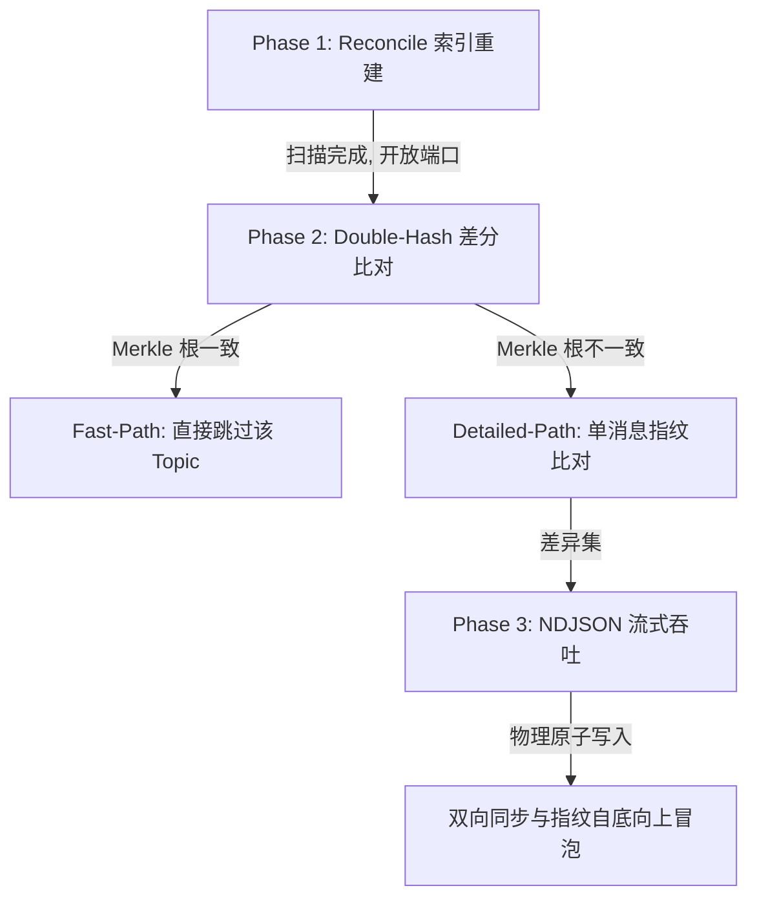

# VCPMobileSync — VCP 移动端双向增量同步服务插件

[](./plugin-manifest.json)
[](https://nodejs.org)
[](#同步协议)

VCPMobileSync 是 VCPChat 桌面端的专属分布式服务插件，为桌面端与 VCPMobile 手机端之间提供**可诊断、失败即停**的双向增量同步。插件采用 CDS / Legacy 双模式的三阶段增量同步架构：实体配置、消息正文、墓碑、头像字节以及消息内附件元数据按各自契约传输；附件二进制始终保留在两端本机 CAS，不属于同步数据面。

---

## 目录

1. [同步范围](#同步范围)
2. [安装与部署](#安装与部署)
3. [架构概览](#架构概览)
4. [同步协议](#同步协议)
5. [HTTP API 参考](#http-api-参考)
6. [WebSocket 控制面参考](#websocket-控制面参考)
7. [数据模型](#数据模型)
8. [数据完整性与安全机制](#数据完整性与安全机制)
9. [日志与可观测性](#日志与可观测性)
10. [故障排查](#故障排查)
11. [版本信息](#版本信息)

---

## 同步范围

| 数据类型 | 说明 | 桌面端物理位置 |
| :--- | :--- | :--- |
| 智能体（Agent） | 名称、系统提示词、温度、采样参数、当前关联的模型配置 | `AppData/Agents/{id}/config.json` |
| 群组（Group） | 群成员列表、群发言策略、群系统提示词、活跃配置等 | `AppData/AgentGroups/{id}/config.json` |
| 话题（Topic） | 挂载于智能体或群组之下的独立子话题元数据 | Owner `config.json.topics[]`；物理存活由 `UserData/{ownerId}/topics/{topicId}/` 决定 |
| 消息历史（Message） | 包含思维链节点、Markdown 文本及元数据的完整聊天链路 | `UserData/{ownerId}/topics/{topicId}/history.json`（桌面聊天的兼容真源） |
| 附件（Attachment） | 只同步消息内附件的元数据与内容 SHA-256；二进制不跨端 | `UserData/attachments/{hash}.{ext}`（各端本机 CAS） |
| 自定义头像（Avatar） | 智能体、群组及用户的个性化头像二进制数据 | `Agents|AgentGroups/{id}/avatar.{png,jpg,jpeg,gif,webp}`、`UserData/user_avatar.png` |

**冲突策略**：自身 Hash 不同时以 `updatedAt` 较新的一端为准（LWW）；消息时间相同再按 `messageHash` 字典序裁决。删除使用显式墓碑，不从 live 列表缺失推断。

---

## 安装与部署

### 安装依赖

插件依赖 SQLite 原生 C++ 驱动 `better-sqlite3`，依赖由宿主 VCPChat 提供（插件自身无独立 `package.json`）。在 VCPChat **桌面端根目录**下执行：

```bash
# 1. 安装底层 SQLite 原生依赖
pnpm install better-sqlite3

# 2. 针对 Electron 的 ABI 版本重新编译原生扩展（发布前必须步骤，
#    否则插件启动会因 ABI 不匹配报错）
pnpm exec electron-rebuild --only better-sqlite3
```

### 配置插件

1. 在插件目录 `VCPMobileSync/` 下复制配置模板：

   ```bash
   cp config.env.example config.env
   ```

2. 编辑 `config.env`：

   ```env
   # 【必填】同步安全令牌。手机端建立连接时的握手凭证，建议设置复杂字符串。
   # 为空时插件启动直接失败。
   MobileSyncToken=your_super_secret_token_here

   # 【可选】插件 WebSocket 控制面监听端口，默认 5975
   MobileSyncPort=5975

   # 【可选】是否使用 CDS 中央索引，默认 true（CDS 模式）；
   # 设为 false 后，重启后的新同步会话切换为 Legacy 模式
   MobileSyncUseCentralIndex=true
   ```

### 手机端配置

打开 VCPMobile → **设置** → **同步设置**，填写：

| 手机端配置项 | 示例值 | 说明 |
| :--- | :--- | :--- |
| HTTP 服务 URL | `http://192.168.1.100:5974` | 桌面端**分布式服务器**的 HTTP 端口（`DIST_SERVER_PORT`，默认 5974）。同步数据面挂载在该端口下，插件不开独立 HTTP 端口 |
| WebSocket 服务 URL | `ws://192.168.1.100:5975` | 本插件同步控制面端口（`MobileSyncPort`，默认 5975） |
| Mobile Sync Token | `your_super_secret_token_here` | 必须与桌面端 `config.env` 中的令牌完全一致 |

> [!WARNING]
> **网络边界**：电脑与手机必须处于同一局域网（同一 WiFi 或经内网穿透 VPN 组网）。WebSocket 服务监听 `0.0.0.0`，Token 是唯一认证手段，**请勿将同步端口暴露到公网**。

### 日常使用

1. **启动服务**：打开 VCPChat 桌面端 → 全局设置 → 高级功能 → 开启「VCP 分布式服务器」→ 重启客户端。
2. **首次同步**：中央索引默认开启，由 VCP-CDS 扫描 Owner、`history.json` 与 Avatar，并维护 `AppData/databases/chat_data.sqlite3`。待 CDS 与 MobileSync 服务就绪后，在手机端点击「立即同步」开始全量传输。
3. **日常增量**：桌面端服务开启期间，手机端在后台保持实时或手动的增量对齐，仅传输变化内容。

---

## 架构概览

### 双模式后端

| | CDS 中央模式（默认） | Legacy 模式 |
| :--- | :--- | :--- |
| 权威状态 | VCP-CDS（Rust 独立进程）维护 `AppData/databases/chat_data.sqlite3` | 插件本地 `sync_state_v2.db`（better-sqlite3） |
| 变更感知 | CDS reconcile | 启动全量扫描 + chokidar 文件监听 |
| 插件内索引 | `:memory:` 兼容视图（仅配置定位/附件索引） | 持久六表索引 |
| 切换方式 | `MobileSyncUseCentralIndex=true`（默认） | `=false`，重启后新会话生效；旧 `sync_state_v2.db` 不自动删除 |

两种模式下，配置文件与头像字节的物理读写、附件路径解析始终由插件负责；`history.json` 始终是桌面聊天的兼容真源。

### VCP-CDS 对接

CDS（`rust_chat_data_service`，二进制 `vcp_chat_data_service`）由 Electron 主进程 spawn，仅绑定回环地址。启动后通过 stdout 输出一次性握手信息（internal protocol 3 / schema 3 / 随机端口 / instanceId / authToken），之后日志走 stderr。Node 侧禁止直接打开 CDS 数据库文件。

插件通过 HTTP 调用 CDS `/v3/sync/*` 接口（manifest / topic-diff / message-diff / entities / owners/reconcile / avatars / messages 共 11 条）。CDS 逐项错误固定为 `{code, message, retryable}`，插件中央适配器在公共边界补齐完整错误字段；`SERVICE_BUSY`（429）由适配器做有界退避，`PROTOCOL_MISMATCH` 重命名为 `CDS_PROTOCOL_MISMATCH` 以区别于 Mobile wire 版本不兼容。

CDS 启动失败时，插件仍开放带 Token 的 WebSocket 控制面，在 wire 版本校验通过后返回结构化 `CDS_*` 错误；HTTP 数据面保持关闭，且**不会自动降级到 Legacy**。

### 端口拓扑

- **HTTP 数据面**：挂在 VCPDistributedServer 的 Express 应用上，前缀 `/api/mobile-sync/*`，即分布式服务器端口（默认 5974）。
- **WebSocket 控制面**：插件独立监听 `MobileSyncPort`（默认 5975）。

---

## 同步协议

### 三阶段增量同步（Sync V2）



- **Phase 1 — Reconcile**：CDS 模式由 CDS 维护 Owner/Topic/Message/Avatar 状态；Legacy 模式扫描 `Agents`、`AgentGroups` 与 `UserData` 建立 `sync_state_v2.db`。先发送 `manifestType=owner` 清单，再发送独立的 `manifestType=avatar` 清单；两者都携带完整复合身份，但 Hash、墓碑与传输语义互不混合。
- **Phase 2 — 双哈希差分比对**：
  - `configHash`：实体自身元数据属性哈希。
  - `contentHash`：Topic 下所有历史消息指纹排序级联求得的 Merkle 聚合根。
  - **Fast-Path**：两端 `configHash` 与 `contentHash` 都一致时直接跳过。
  - **Detailed-Path**：仅 `contentHash` 不一致时，Mobile 发送 `SYNC_MESSAGE_DIFF_REQUEST` 携带显式 live/墓碑状态，Desktop 返回 `pullMessageIds / pushTopic / deleteMessages`。
  - **快照漂移**：Phase 2 完成后 Topic 配置再变化，或请求中的 live Topic 已消失/成为墓碑，Desktop 返回 `SYNC_SNAPSHOT_STALE`，Mobile 复用完整 attempt 重试。
- **Phase 3 — NDJSON 流式吞吐**：消息拉取/推送使用 `application/x-ndjson` 逐 Topic 传输，避免全量缓冲导致 OOM。单 NDJSON 帧上限 32 MiB；单次同步 attempt 的总量预算（256 MiB / 10,000 Topic / 100,000 Message）由协议约定、移动端强制执行。

### 版本协商（Wire 1.5）

连接建立后首帧必须是版本协商：

```text
VERSION_CHECK { versions: [{component:"mobile_app",version:<App>},
                           {component:"wire",version:"1.5"}] }
VERSION_ACK   { versions: [{component:"desktop_plugin",version:"2.0.0"},
                           {component:"wire",version:"1.5"}],
                backendMode: "legacy" | "cds" }
```

- `versions` 数组顺序无关但组件必须唯一：CHECK 固定 `mobile_app + wire`，ACK 固定 `desktop_plugin + wire`。
- 兼容性只由 `wire` 字段精确判断（精确匹配，不兼容旧版）；包版本是诊断信息。
- 首帧不是 `VERSION_CHECK` 返回 `VERSION_CHECK_REQUIRED`；重复协商返回 `VERSION_CHECK_DUPLICATE`。
- `backendMode` 只声明当前桌面同步后端，不允许 Mobile 据此改变同步算法。

### Phase 3 逐项结果契约

每个 Topic 的 decision 必须是以下判别联合之一：

```text
{ ownerType, ownerId, topicId, ok: true,
  pullMessageIds: string[], pushTopic: boolean, deleteMessages: MessageTombstone[] }
{ ownerType, ownerId, topicId, ok: false, error: WireSyncError }
```

缺字段、错类型、重复身份、`ok:false` 或未知帧都会终止当前 attempt，不能进入完成态。`PHASE_COMPLETED` 的 `PHASE_ACK` 原样回显 `phase`、`sessionId`、`attemptId` 与 `nonce`，避免迟到或重放的 ACK 完成错误会话。

### 统一错误契约

错误在 WebSocket、HTTP、NDJSON 和逐 Topic 结果中复用同一个七字段对象：

```json
{
  "code": "SYNC_OWNER_CONFLICT",
  "origin": "desktop_cds",
  "stage": "messages",
  "kind": "data",
  "retry": "manual",
  "message": "owner identity conflict",
  "failedTopicIds": ["topic-a"]
}
```

- 固定外壳：WS `SYNC_ERROR.error`、HTTP `{error}`、逐项 `{ok:false,error}`、NDJSON `{kind:"streamError",error}`。
- 七个字段必须齐全，未知字段与字符串错误一律拒绝。`message` 保留完整诊断原文，Mobile 按 `code` 提供分类与重试语义，但不覆盖根因文本。
- `origin` ∈ `mobile_ui / mobile_native / mobile_sync / desktop_plugin / desktop_cds`；`retry` ∈ `automatic / after_user_action / manual / never`。
- 全部 60 个错误码在 `error-contract.js` 的 `ERROR_DEFINITIONS` 注册表中钉死 `kind/retry`，不匹配即 `PROTOCOL_INVALID`。
- `SERVICE_BUSY` 先在插件内部做有界退避；耗尽后跨端上报时 `retry=manual`。

### 身份与 Canonical 化

Owner、Topic、Message 与 Avatar 的外层协议都携带完整复合身份 `(ownerType, ownerId[, topicId[, msgId]])`，协议不通过 `LIKE`、目录前缀或名称拼接猜测身份。Legacy 物理历史在 canonicalizer 边界转换为 wire DTO：附件 hash 只接受顶层或 `_fileManagerData.hash` 中一致的 64 位十六进制值并转为小写；缺失、非法或冲突附件只产生有界 warning，消息本身保留。`contentHash` 在 Pull/Push 中都是必填的小写 SHA-256；Desktop Push 会在写物理 `history.json` 前剥离该派生字段，避免普通编辑路径留下陈旧缓存。

---

## HTTP API 参考

所有路由挂载于 `/api/mobile-sync`，使用 `Authorization: Bearer <MobileSyncToken>` 认证。

| Endpoint | 方法 | 用途 | 限制 |
| :--- | :--- | :--- | :--- |
| `/entities/pull` | POST | 批量拉取 Owner/Topic DTO | body ≤ 10 MiB，精确键校验 |
| `/entities/push` | POST | 批量推送 Owner/Topic DTO；支持 `X-Idempotency-Key`（TTL 5 分钟）；CDS 模式下成功项在响应前落库 | body ≤ 10 MiB |
| `/messages/pull` | POST | 消息 NDJSON 流式拉取 | 请求 body ≤ 34 MiB；NDJSON 单帧 ≤ 32 MiB |
| `/messages/push` | POST | 消息+墓碑 NDJSON 流式推送（直接消费请求流） | NDJSON 单帧 ≤ 32 MiB |
| `/avatars/pull` | GET | 头像二进制下载（query 精确 `ownerType/ownerId`） | — |
| `/avatars/push` | POST | 头像二进制上传 | raw body ≤ 20 MiB |

兜底行为：未知路径 → 404 `SYNC_REQUEST_INVALID`；body 超限 → 413 `SYNC_BUDGET_EXCEEDED`；JSON 解析失败 → 400。

---

## WebSocket 控制面参考

服务监听 `MobileSyncPort`（默认 5975，`0.0.0.0`），仅接受路径 `/` 与 `/ws-sync`，通过 `?token=` 认证。`maxPayload` 32 MiB；所有消息经 `messageChain` 串行处理；JSON 解析拒绝重复键。

| 帧类型 | 方向 | 用途 |
| :--- | :--- | :--- |
| `VERSION_CHECK` / `VERSION_ACK` | M→D / D→M | 版本协商（必须是首帧），ACK 携带 `backendMode` |
| `PHASE_START` / `PHASE_COMPLETED` / `PHASE_ACK` | 双向 | 阶段控制；messages 完成帧必须携带 `sessionId/attemptId/nonce` |
| `SYNC_MANIFEST_REQUEST` | M→D | 清单请求，`manifestType` ∈ `owner / topic / avatar`（topic 可带 `targetedOwners`） |
| `SYNC_TOPIC_DIFF_REQUEST` | M→D | Topic 级哈希差分 |
| `SYNC_MESSAGE_DIFF_REQUEST` | M→D | 消息级详细差分（Detailed-Path） |
| `SYNC_ENTITY_DELETE` | M→D | 实体删除，`targetType` ∈ `owner / topic / avatar / message` |
| `SYNC_ERROR` | 双向 | 统一七字段错误外壳 |
| `SYNC_LOG_EVENT` / `DESKTOP_PHASE_START` / `DESKTOP_PHASE_COMPLETE` | D→M | 日志与阶段事件广播 |

关闭码：`4001` Token 错误；`4002` 路径不支持；`1002` 协议失败。响应超过 32 MiB 时返回 `SYNC_BUDGET_EXCEEDED`。

---

## 数据模型

### CDS 模式

Owner、Topic、Message、Avatar、Tombstone 与 history source 状态由 VCP-CDS 的 `chat_data.sqlite3` 管理（同目录另有 Tantivy 搜索索引与进程锁文件）。CDS 数据库文件只能由 CDS 进程访问。

### Legacy 模式（`sync_state_v2.db`）

| 表 | 主键 / 职责 |
| :--- | :--- |
| `owners` | `(owner_type, owner_id)`；Owner DTO Hash、持久化 Topic 聚合根、配置路径、时间与墓碑 |
| `topics` | `(owner_type, owner_id, topic_id)`；Topic DTO Hash、消息内容根、时间与墓碑 |
| `messages` | `(owner_type, owner_id, topic_id, msg_id)`；消息指纹、LWW 时间与墓碑 |
| `attachment_index` | `hash`；只保存本机已有附件的物理路径 |
| `avatar_index` | `(owner_id, owner_type)`；头像字节 Hash、路径、`mtime_ms`/size 快路证据、同步时间与墓碑 |
| `history_source_state` | `(owner_type, owner_id, topic_id)`；mtime、size、原始文件 SHA-256、路径与索引版本快路径 |

两种模式都从规范消息保存附件元数据，不维护同步专用附件关系表。

---

## 数据完整性与安全机制

### 防哈希分裂（stableStringify）

桌面端（JavaScript）与手机端（Rust）的 JSON 序列化行为存在物理差异，直接哈希会产生"哈希分裂"。`stableStringify` 通过以下规则对齐两端：

- 所有 Key 按 UTF-8 字节序排序后级联序列化；
- 自动剔除 `undefined` 与 `null`，对齐 Rust `serde(skip_serializing_if)` 行为；
- `temperature` 字段四舍五入保留两位小数，整数强制格式化为 `toFixed(1)`（如 `1` → `"1.0"`），与 Rust serde 输出对齐。

### 哈希体系

消息指纹覆盖 id/role/content/timestamp/name/agentId 与附件 hash；leaf hash 之上，Topic 与 Owner 的聚合根按排序级联 SHA-256（Merkle）计算，Phase 2 的比对与 Phase 3 完成后的指纹自底向上冒泡都基于该体系。

### 墓碑机制

删除消息携带明确的 `topicId`、`msgId` 与非负安全整数 `deletedAt`，不靠"上传列表里缺少该消息"猜测删除；墓碑 hash 固定为 64 个 `"0"`。重试不改写墓碑时间，重复通知保留最早的已提交 `deletedAt`。CDS 模式先从桌面原生历史中移除消息并严格摄取，再在同一复合身份下写入显式墓碑；本机从未见过的消息也会留下墓碑。

### 并发与原子写入

- **路径级互斥锁**：同一插件进程内对相同 `history.json` 的同步操作串行化。
- **原子替换**：严格读取历史快照并记录来源 SHA-256；提交前再次校验，写入唯一临时文件、fsync 落盘后原子替换。文件不存在视为空；空文件、JSON 错误、根结构错误与普通 I/O 错误均失败。
- **写意图锁（Write Intent Lock）**：大批量拉取写入时将相关话题 ID 录入意图锁集合，文件监听器捕获到处于锁定状态的变更事件时主动跳过，消除"同步写入触发 watcher 再次 reconcile"的并发回环。

> [!NOTE]
> 普通聊天保存逻辑不使用同步的进程内锁。来源 hash 校验能检测并发修改并让同步失败重试，但「最终校验到原子替换」之间仍存在极窄的竞态窗口。

---

## 日志与可观测性

插件内置 Session → Phase → Operation 三层日志链路：

- **Session**：一次完整连接同步生命周期的起始；
- **Phase**：核心物理阶段（`reconcile` 扫描、`topic_metadata` 比对、`messages` 流传输）；
- **Operation**：单条数据在数据库、文件层面的操作轨迹与结果。

WebSocket 连接会广播 `SYNC_LOG_EVENT` / `DESKTOP_PHASE_START` / `DESKTOP_PHASE_COMPLETE`，供手机端实时展示同步进度。

**日志位置与轮转**：默认写入插件目录 `logs/sync/`；若宿主设置了隔离数据根 `VCPCHAT_APP_DATA_DIR`，则写入 `<数据根>/PluginLogs/VCPMobileSync/sync/`。每次初始化 `SyncLogger` 时自动清理：最多保留 30 个 `.log` 文件，超出部分按修改时间从旧到新物理删除，长期运行磁盘占用恒定受控。

---

## 故障排查

| 现象 | 可能原因 | 解决办法 |
| :--- | :--- | :--- |
| 手机端完全无法连接桌面端 | 分布式服务器未开启；局域网防火墙拦截 | 开启高级功能后**重启桌面客户端**；放行 5974（HTTP）与 5975（WebSocket）入站 |
| 握手失败「Unauthorized」/ 关闭码 4001 | 两端 Token 不一致 | 核对桌面端 `config.env` 的 `MobileSyncToken` 与手机端填写值完全一致（区分大小写） |
| 关闭码 4002 | WebSocket 路径不支持 | 仅接受 `/` 与 `/ws-sync`，检查手机端 WS URL 是否带有多余路径 |
| 握手后收到 `CDS_*` 错误（`CDS_UNAVAILABLE` / `CDS_BINARY_NOT_FOUND` / `CDS_PROTOCOL_MISMATCH` / `CDS_SCHEMA_MISMATCH` / `CDS_STARTUP_FAILED`） | CDS 二进制缺失、协议或 schema 版本不匹配 | 成对升级桌面端各组件；CDS 未就绪时 HTTP 数据面保持关闭，不会自动降级 Legacy |
| 初次同步耗时较长 | 历史数据规模较大 | 属正常现象；后续同步仅在 Hash 不一致时进入详细路径，流量通常仅几十 KB |
| 数据库或依赖报错 | `better-sqlite3` ABI 与 Electron 不匹配 | 在桌面端根目录执行 `pnpm exec electron-rebuild --only better-sqlite3` |

---

## 版本信息

- **当前版本**：`2.0.0`
- **适配标准**：wire protocol 1.5 / VCP-CDS internal protocol 3 / CDS schema 3 / 配对 VCPMobile 1.1.6
- **升级要求**：wire 协议采用精确匹配，不支持跨版本混跑；桌面端与 Mobile 必须成对升级、成对回滚
- **CDS 版本纪律**：每次部署型 Rust 更新递增 internal protocol，并同步 Electron 生命周期的期望值；只有数据库结构变化才递增 schema
- **架构师 / 作者**：Nova
- **开源许可**：VCP 闭环生态核心插件
