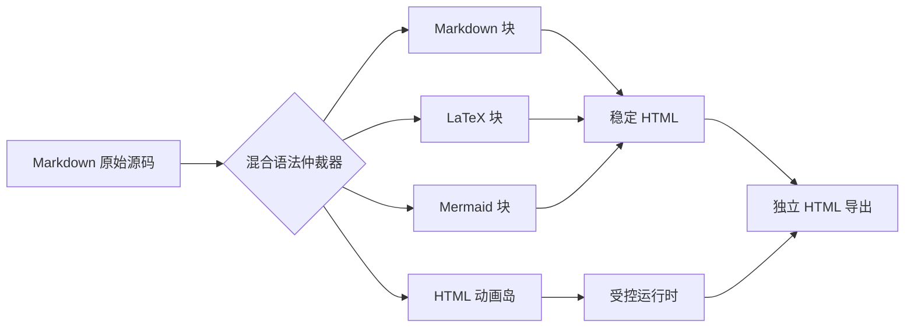

<h1 id="ultimate-test-title">Scriptorium 混合富文档终极测试</h1>

> 这是一份用于验证 Markdown-first、原生 HTML、LaTeX、Mermaid、网络媒体、Anime.js、CSS 3D、动态表格与局部文字特效能否在同一份源码中稳定共存的测试文档。

> **岛闭合规则：** 每个可编程岛从带有 `data-vdoc-island` 的根 `
` 开始，到与该根匹配的最后一个 `
` 结束。岛的结构、局部样式、依赖声明和执行脚本必须全部位于这个范围内，任何岛内状态都不得泄漏到后续 Markdown 正文。

## 1. 网络图片与普通 Markdown

下面的猫咪图片直接使用远程 `src`，用于测试网络资源解析、缓存、导出本地化、离线降级和图片说明语义。

**图片说明：** 猫咪的近距离肖像。渲染器应保留替代文字，并在网络不可用时提供可读降级。点击图片应当可以编辑链接。

这一段完全由 Markdown 编写。它包含 **粗体**、*斜体*、~~删除线~~、`行内代码` 和一个 [示例链接](https://example.com)。

- 第一项用于测试无序列表。
- 第二项包含 **嵌套强调**。
- 第三项提醒我们：普通正文不需要永久 DOM ID。

## 2. LaTeX 公式

行内公式展示质能关系：\(E = mc^2\)。

块级公式展示高斯积分：

$$
\int_{-\infty}^{+\infty} e^{-x^2}\,dx = \sqrt{\pi}
$$

再测试一个矩阵：

\[
A =
\begin{bmatrix}
1 & 2 \\
3 & 4
\end{bmatrix},
\qquad
\det(A) = -2
\]

## 3. Mermaid 图

## 4. 原生 Anime.js 动画岛

下面整个根元素是一个完整动画岛。外部依赖声明和初始化脚本都位于岛根内部，最后的根闭合标签是生命周期边界。

    

    
ANIME.JS ORBIT GARDEN

    

    

    

    

    

    <button type="button" class="anime-replay">重新绽放</button>

    

    

上一个动画岛已经在根闭合标签处结束。这一行必须重新由 Markdown 解析器解释，不能被视为动画岛的一部分。
点击文本动画应当被暂停，文本编辑应该映射到源码，源码变动应当不刷新动画状态，文本编辑应当改变动画文本。

## 5. 基于 Div 的 3D 文本块

    

    

        
文字也可以拥有空间

        

            移动鼠标观察景深；离屏后它应保持静态且不产生后台 I/O。
        

        

    

    

        

            

            

            

            

            

            

        

    

    

        <canvas class="three-d-sphere-canvas"></canvas>
        曲面印刷 A
        真实贴图 B
        THREE.JS · UV TEXTURE
    

    

    

3D 岛也已闭合。后续标题和正文不属于 3D 岛。
立方体文本仍属于独立 DOM 节点。球体使用 Three.js 的真实 `SphereGeometry` 和 Canvas UV 纹理：两个源文本节点保留在 DOM 中供编辑器映射，渲染文本通过纹理贴合曲面并接受透视、遮挡和光照。文档组件不实现任何点击暂停或恢复逻辑；选择文本、进入编辑及离开视口时，动画的冻结与原状态恢复必须完全由引擎接管。源文本变动后，引擎可调用岛运行时的 `repaint()` 更新贴图且不重建球体状态。

## 6. 动态高级表格

在一切开始前我随便输入一个`
`和`

    

        

            <strong class="table-title">猫咪观测数据</strong>
            

                按钮、分页、状态和动态 DOM 的综合测试
            

        

        
    

    

        <table>
            <thead>
                <tr>
                    <th>编号</th>
                    <th>名字</th>
                    <th>毛色</th>
                    <th>状态</th>
                    <th>评分</th>
                </tr>
            </thead>
            <tbody class="table-body"></tbody>
        </table>
    

    

        <button type="button" data-table-action="previous">← 上一页</button>
        
        <button type="button" data-table-action="next">下一页 →</button>
    

    

动态表格岛在上一个根闭合标签处结束。表格的按钮、脚本和动态行不得吞入下面的 Markdown 段落。

## 7. Markdown 正文与 HTML 文字特效混排

这是一段普通 Markdown 正文，前半部分应当保持朴素、稳定并且易于编辑；这一小段文字由 HTML 加入流动背景、粗体和局部颜色特效；随后文本重新回到 Markdown 的自然书写方式。编辑器应只修改被操作的最小源码区间，而不是把整个段落转换成冗长 HTML。

### 继续测试普通正文

当复杂组件离开视口时，它们的动画、计时器、媒体和主动测量应被冻结，但已经完成渲染的静态结构仍然可以供全文搜索和 AI 语义阅读使用。

AI 阅读这份文档时，应当能够理解：

1. 猫咪图片的地址、替代文字和说明。
2. 公式的原始 LaTeX 语义。
3. Mermaid 图表达的处理流程。
4. Anime.js 岛是一个绕核心运动的花瓣动画。
5. 3D 文本块表达“文字也可以拥有空间”。
6. 动态表格拥有十条数据和分页交互。
7. 局部文字特效不改变周围 Markdown 的可读性。

> 终极测试的目标不是让所有语法进入同一解析器，而是验证每个语法域都拥有确定边界、完整闭合、局部生命周期和可读降级。

## 8. 最后一段 Markdown

文档的最后一段仍然是普通 Markdown。它用于验证经过多个完整闭合的 HTML 岛、局部样式和岛内脚本之后，Markdown 解析器仍能恢复到正确的正文状态。

如果这句话可以被直接选中、修改、保存、撤销、重新渲染和导出，且前面的动画岛不被无关地重新启动，那么新的源码范式就通过了最关键的一项测试。

    作者：VCP Scriptorium 架构测试组 
    
        Human × AI · Markdown-first Programmable Document
    

